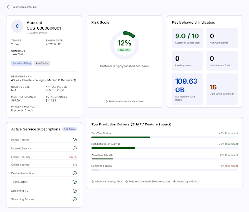
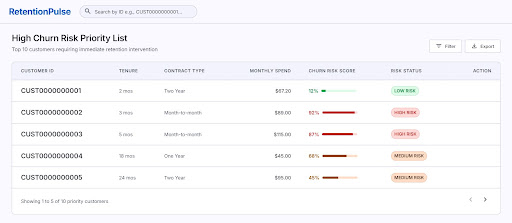
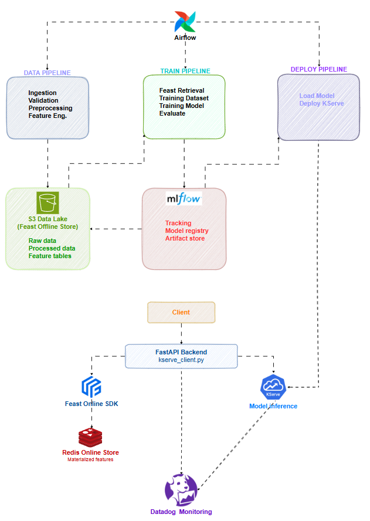
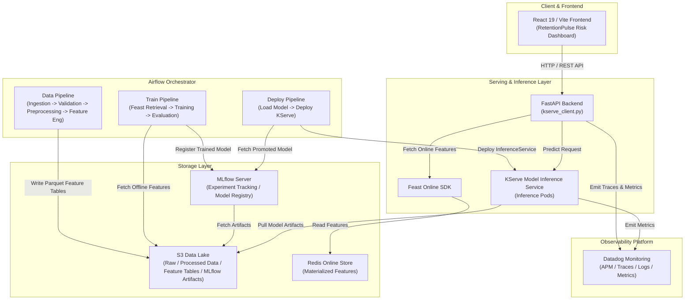

# RetentionPulse Risk Intelligence — Customer Attrition MLOps Platform

**RetentionPulse Risk Intelligence** is an end-to-end **MLOps (Machine Learning Operations)** platform designed to predict, detect early, and manage customer attrition (churn) risks for SaaS and subscription-based enterprises.

The platform integrates feature store management (**Feast**), experiment tracking & model registry (**MLflow**), automated workflow orchestration (**Apache Airflow**), high-performance model serving on Kubernetes (**KServe**), backend application API (**FastAPI**), an executive dashboard (**React 19 / Vite**), and real-time observability (**Datadog**).

---

## 📸 1. Application Interface & System Architecture

### 🎨 Risk Intelligence Executive Dashboard

| Customer Risk Analysis & Explainable AI (XAI) | High Churn Risk Priority List |
| :---: | :---: |
|  |  |

---

### 🏗️ MLOps System Architecture Diagram

Below is the end-to-end MLOps architecture diagram of the platform:



#### System Architecture Flowchart (Mermaid Diagram)



---

## 🛠️ 2. Technology Stack

The platform is engineered using modern technologies across the Cloud-Native and Data/AI ecosystems:

| Layer | Technologies & Libraries | Role in System |
| :--- | :--- | :--- |
| **Frontend UI** | **React 19**, **TypeScript**, **Vite**, **TailwindCSS v4**, **Recharts**, **TanStack Table**, **Lucide React** | Executive web dashboard rendering customer risk scores, XAI breakdowns, and retention action items. |
| **Backend API** | **FastAPI**, **Uvicorn**, **Pydantic v2**, **SQLAlchemy**, **Alembic**, **PostgreSQL**, **Redis SDK**, **Boto3**, **httpx** | Primary application API handling client requests, orchestrating Feature Store retrieval, and routing inference calls to KServe. |
| **Feature Store** | **Feast** (Offline Store: S3 / Parquet, Online Store: Redis) | Unified feature repository ensuring point-in-time correct training datasets and low-latency online feature serving. |
| **Data & ML Training** | **Python 3.11+**, **Scikit-Learn**, **XGBoost**, **LightGBM**, **Pandas**, **PyArrow**, **Great Expectations** | Data processing, automated data quality validation, churn model training, and evaluation metrics computation. |
| **MLOps & Registry** | **MLflow** (Tracking Server, Model Registry, Artifact Store) | Experiment tracking (hyperparameters, metrics), versioned model registry, and artifact storage. |
| **Model Serving** | **KServe** (InferenceService CRD), Custom Python Model Server (`serving/`) | Kubernetes-native model serving platform supporting autoscaling, canary deployments, and zero-downtime rollouts. |
| **Orchestration** | **Apache Airflow** | Workflow scheduler executing the 3 core pipelines: Data Pipeline, Train Pipeline, and Deploy Pipeline. |
| **Infrastructure** | **Kubernetes** (**Kind** local / **EKS / GKE** prod), **Docker**, **K8s Manifests / Helm** | Containerization and cloud-native service orchestration. |
| **Observability** | **Datadog** (`ddtrace`, APM Tracing, Log Management, Custom Metrics) | Full-stack monitoring covering FastAPI API routes and KServe Inference Pods. |

---

## 🔄 3. Operational Mechanics & MLOps Architecture

### Key MLOps Architectural Principles

1. **Batch Pipeline vs. Runtime Path Decoupling**:
   - Data ingestion, validation, training, and deployment pipelines (managed by **Airflow**) run asynchronously on batch schedules.
   - The real-time inference path (**Client -> FastAPI -> Feast Online -> KServe**) is a synchronous, low-latency (<50ms) runtime pipeline that operates independently of Airflow.

2. **Prevention of Training-Serving Skew**:
   - **Feast Feature Store** serves as the single source of truth for both offline batch training and online real-time inference.

3. **Loose Coupling via Storage**:
   - Pipelines do not invoke each other directly. They communicate exclusively through shared storage: **S3 Data Lake** (offline data/artifacts) and the **MLflow Model Registry**.

4. **Zero-Downtime Model Deployments**:
   - KServe manages `InferenceService` revisions. When a new model is deployed, KServe performs readiness and health checks before shifting live traffic.

---

### Detailed Pipeline Workflows

#### 1. Data Pipeline (Airflow Orchestrated)
- **Ingestion**: Ingests raw customer interaction and usage data into S3.
- **Validation**: Enforces data quality rules using **Great Expectations** (type checks, null checks, value bounds).
- **Preprocessing & Feature Engineering**: Transforms validated data into standardized Feature Tables saved as Parquet files on **S3 Data Lake** (Feast Offline Store).

#### 2. Feature Materialization Workflow
- Loads the latest feature values from the S3 Data Lake into the **Redis Online Store** via `feast materialize`, preparing features for instant online lookup.

#### 3. Train Pipeline (Airflow Orchestrated)
- Retrieves point-in-time accurate historical training data from Feast (`event_timestamp`).
- Trains machine learning models (XGBoost / LightGBM / Scikit-Learn) and evaluates key performance metrics (ROC-AUC, Precision, Recall, F1-Score).
- Registers production-ready models to the **MLflow Model Registry**.

#### 4. Deploy Pipeline (Airflow Orchestrated)
- Fetches the promoted model version from the MLflow Model Registry.
- Renders and applies the **KServe InferenceService** manifest to the Kubernetes cluster. KServe pulls the model artifacts from S3 and launches serving pods.

#### 5. Runtime Low-Latency Inference Path (Real-time Prediction)
- **Client (React UI)** requests prediction for a customer ID via **FastAPI Backend**.
- **FastAPI** calls `kserve_client.py`, retrieving the customer's online feature vector from **Redis** using the **Feast SDK**.
- **FastAPI** passes the feature vector to **KServe Pods**, receiving the churn risk score & feature attributions.
- Returns prediction results to the client UI and asynchronously emits traces, logs, and telemetry to **Datadog**.

---

## 🧩 4. Repository Structure & Deployment Topology

### Source Layout

```text
customer-attrition/
├── frontend/               # React 19 + TypeScript + Vite UI (RetentionPulse Risk Intelligence)
├── backend/                # FastAPI Application Backend & KServe Client integration
│   └── app/services/       # Service layer (kserve_client.py, feast_service.py)
├── mlops/                  # Core MLOps Logic & Pipelines
│   ├── src/customer_attrition/
│   │   ├── ingestion/      # Raw data ingestion
│   │   ├── validation/     # Data quality checks (Great Expectations)
│   │   ├── preprocessing/  # Data preprocessing
│   │   ├── features/       # Feature Engineering
│   │   └── training/       # Model training & MLflow registration
│   ├── feast/              # Feast Feature Repository (feature_store.yaml & definitions)
│   ├── airflow/            # Airflow DAG definitions
│   └── scripts/            # Manual training & materialization scripts
├── serving/                # Custom Model Server code for KServe
│   └── model_server/
├── k8s/                    # Kubernetes Manifests (FastAPI, KServe, Redis, Postgres, MLflow, Airflow)
├── observability/          # Datadog dashboards, monitors & tracing configs
├── docs/                   # Architecture, data flow, deployment, and testing documentation
└── data/samples/           # Sample datasets for local development
```

---

### Component Deployment Topology

| Component | Deployment Target | Description |
| :--- | :--- | :--- |
| **FastAPI Backend** | **Kubernetes Cluster** (`Deployment` & `Service`) | Runs in K8s Pods, auto-scalable based on API request traffic. |
| **KServe Inference Server** | **Kubernetes Cluster** (`InferenceService` CRD) | Custom inference pods managed by KServe Controller on K8s. |
| **React 19 Frontend** | **Static Host / Nginx on Kubernetes** | Production static build served via Nginx container or CDN. |
| **Feast Offline Store** | **AWS S3 / MinIO Object Storage** | Stores historical Parquet feature tables. |
| **Feast Online Store** | **Redis Cluster / StatefulSet** | In-memory key-value store for ultra-low latency feature retrieval (<5ms). |
| **MLflow Server** | **Kubernetes Cluster + S3 + Postgres** | Web UI & API tracking server on K8s; stores metadata in Postgres and artifacts in S3. |
| **Apache Airflow** | **Kubernetes Cluster** (Webserver, Scheduler, Workers) | Deployed via Helm/K8s Manifests to orchestrate batch DAG pipelines. |
| **PostgreSQL Database** | **Kubernetes StatefulSet / Managed RDS** | Database store for Airflow metadata, MLflow metadata, and FastAPI application tables. |
| **Datadog Observability** | **Datadog SaaS Cloud Platform** | K8s Datadog Agent forwards traces, logs, and performance metrics to Datadog Cloud. |

---

## 🚀 5. Quickstart & Development Guide

### Install Development Dependencies

```bash
pip install -r requirements-dev.txt
```

### Code Quality & Testing

```bash
# Run linting
ruff check .

# Check code formatting
ruff format --check .

# Run type checks
mypy backend mlops/src serving

# Run unit tests
pytest
```

### Running Backend Locally

```bash
uvicorn backend.app.main:app --reload
```

### Feature Store Operations (Feast)

```bash
# Apply Feast feature definitions
cd mlops/feast
feast apply

# Materialize features into Redis Online Store
python mlops/scripts/materialize_features.py
```

### Running Local Training Pipeline

```bash
python mlops/scripts/train_model.py
```

### Local Kubernetes Deployment (Kind)

```bash
# Create local Kind cluster
kind create cluster

# Apply all Kubernetes manifests
kubectl apply -f k8s/
```

---

## 📚 6. Documentation References

- **Architecture Overview**: [`docs/architecture.md`](docs/architecture.md)
- **Detailed Data Flow**: [`docs/data-flow.md`](docs/data-flow.md)
- **Feature Store Specification**: [`docs/feature-store.md`](docs/feature-store.md)
- **Model Lifecycle & Serving**: [`docs/model-lifecycle.md`](docs/model-lifecycle.md)
- **Kubernetes Deployment**: [`docs/deployment.md`](docs/deployment.md)
- **Observability & Monitoring**: [`docs/observability.md`](docs/observability.md)
